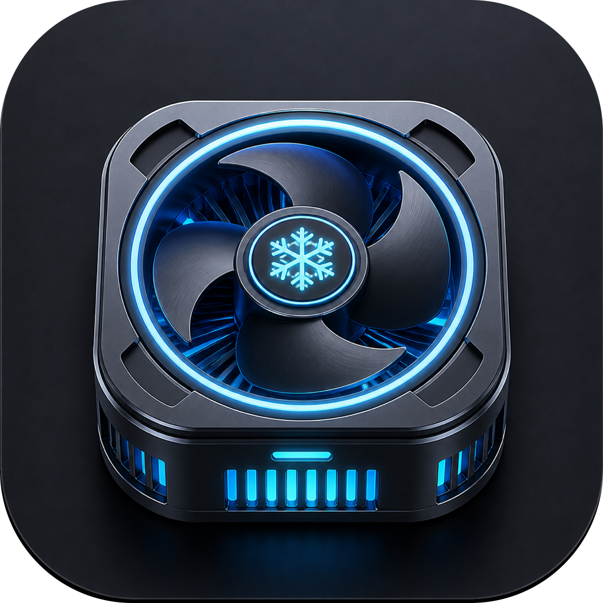
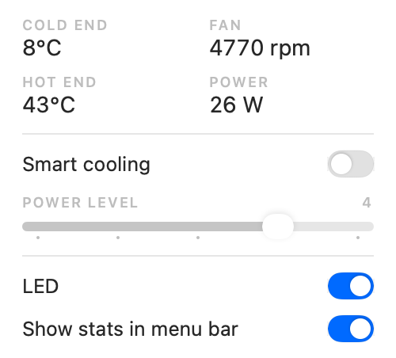

# FunCooler

<p align="center">
  
</p>

A Mac menu bar app for the **Black Shark MagCooler 5 Pro** (FunCooler 5 Pro) phone cooler.
Live temperatures, fan speed and power draw in the menu bar, plus fan and lighting
control — without the official app.

The cooler speaks an undocumented BLE protocol. It was reverse-engineered from
scratch for this app; the full write-up is in [PROTOCOL.md](PROTOCOL.md).

<p align="center">
  
</p>

## Why

The MacBook Air M4 is fanless: it cools passively, so under sustained load it
throttles once the chassis heats up. This magnetic phone cooler turns out to work
just as well stuck to the bottom of the Air — its Peltier cold plate pulls heat
straight out of the case. The only problem was that controlling it required the
official phone app; this project removes that dependency so the cooler can live
on the Mac it is cooling.

```
COLD END   8°C        FAN     4770 rpm
HOT END   43°C        POWER     26 W
──────────────────────────────────────
Smart cooling                    ( ●)
POWER LEVEL                          3
●────────────────────────────────────
──────────────────────────────────────
LED                              ( ●)
Show stats in menu bar           ( ●)
──────────────────────────────────────
Advanced                             ▸
Quit FunCooler                      ⌘Q
```

## What it does

- **Live telemetry** — cold-end and hot-end temperature, fan RPM and power draw,
  refreshed every 2 seconds. Optionally shown next to the menu bar icon.
- **Smart cooling** — hand the fan back to the cooler's own controller.
- **Power level** — with Smart off, a five-step slider drives the fan directly
  (level 5 reaches ~5400 rpm / 35 W, above the official app's "Overclock").
- **LED** — turn the lighting on or off.
- **Connects on launch**, and if the cooler is missing it says so and offers
  Retry instead of silently reconnecting forever.

## Requirements

- Apple Silicon Mac, macOS 13 or later (developed and tested on macOS 27)
- Xcode, including its command-line compiler (`swiftc`) and asset compiler
  (`actool`), for building
- A Black Shark MagCooler 5 Pro, powered on and in range

## Build and run

```bash
./build.sh
open build/FunCooler.app
```

macOS will ask for Bluetooth permission the first time — click **Allow**. The app
lives only in the menu bar (no Dock icon).

`build.sh` compiles `Sources/main.swift`, packages the app icon asset catalog,
assembles `build/FunCooler.app`, and ad-hoc signs it. Two details matter and are
easy to get wrong:

- The bundle **must** carry `NSBluetoothAlwaysUsageDescription`. Without it macOS
  kills the process the instant it touches CoreBluetooth (this is also why a
  Python/`bleak` script cannot work here — it is aborted by TCC on sight).
- The deployment target is pinned to macOS 13. Left to itself the compiler
  targets a newer macOS than the host and LaunchServices refuses to open the app
  with error `-10825`.

Launch it with `open`, not by running the binary directly: started from a shell,
macOS attributes the Bluetooth request to the parent process and aborts it.

## Notes and limitations

- **The cooler's identifier is hard-coded** in `KNOWN_COOLER_UUID` so it can
  connect instantly. On a different Mac or a different unit, that UUID will not
  match; the app then falls back to scanning and probing for a device with the
  cooler's service, and the identifier can be read from the log window
  (Advanced ▸ Show Log Window).
- **The cooler never reports its mode or LED state.** The app remembers your
  choices and re-applies them on connect. If you change something from the
  official app in the meantime, the menu can disagree until you toggle it once.
- **The switches use your system accent colour.** macOS ignores `.tint()` for
  native switches in a menu ([Apple engineer's reply][tint]), so the popup uses
  a compact custom switch track while preserving standard interaction.
- **Rebuilding re-triggers the Bluetooth prompt.** Ad-hoc signing gives the app a
  new identity on every build, so macOS asks again. A stable signing certificate
  would avoid it.
- Only on/off lighting is supported. Colour and effect commands were not captured.

[tint]: https://developer.apple.com/forums/thread/802100

## Sharing the cooler with the official app

The cooler accepts a second connection **only if Shark Arsenal connects first**.
Connect there, then let this app attach. In the other order, the official app is
locked out. A phone takes the connection exclusively.

## Troubleshooting

| Symptom | Cause |
|---|---|
| "Cooler disconnected" with Retry | Cooler is off, out of range, or claimed by another device. Click Retry once it is back. |
| Nothing happens at launch, no prompt | Bluetooth permission was denied. Re-enable FunCooler under System Settings ▸ Privacy & Security ▸ Bluetooth. |
| Readings stuck at `—` | Not connected — the cooler only reports when polled, and polling needs a live link. |
| Menu shows the wrong mode | The cooler does not report state; toggle once to resync. |

## Repository layout

| Path | Purpose |
|---|---|
| `Sources/main.swift` | The whole app: BLE client, protocol, SwiftUI menu panel |
| `Assets.xcassets/AppIcon.appiconset` | App icon: cyan-lit cooler fan and snowflake |
| `build.sh` | Builds and ad-hoc signs `build/FunCooler.app` |
| `PROTOCOL.md` | The reverse-engineered protocol and how it was captured |
| `tools/parse_btsnoop.py` | Extracts ATT writes from an Android btsnoop capture |
| `tools/probe.sh`, `tools/sweep.sh` | Send frames to the cooler and report replies |
| `tools/watch.py` | Tails the log and surfaces protocol changes |
| `docs_gatt_dump.txt` | Raw GATT dump from the first successful connection |

## License

[MIT](LICENSE).

## Disclaimer

Unofficial and unaffiliated with Black Shark. Built for personal use with hardware
I own. It writes only the documented control commands and never touches the OTA
service; even so, it talks to your hardware at a level the vendor does not
support, so use it at your own risk.
